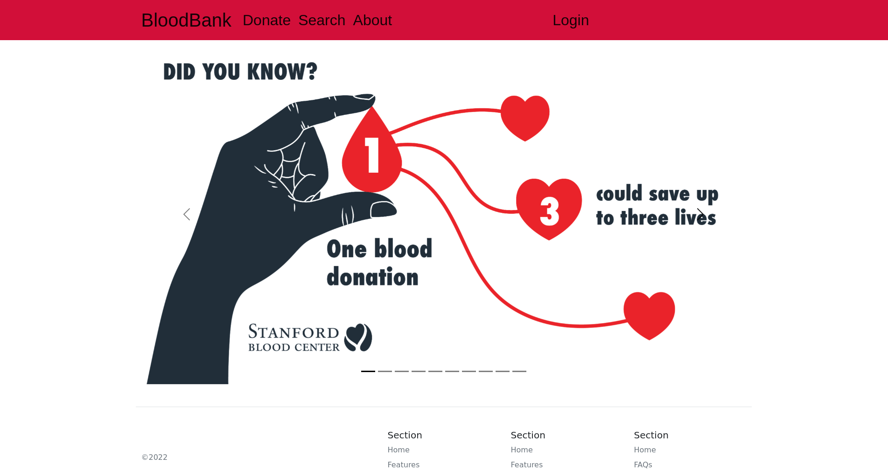
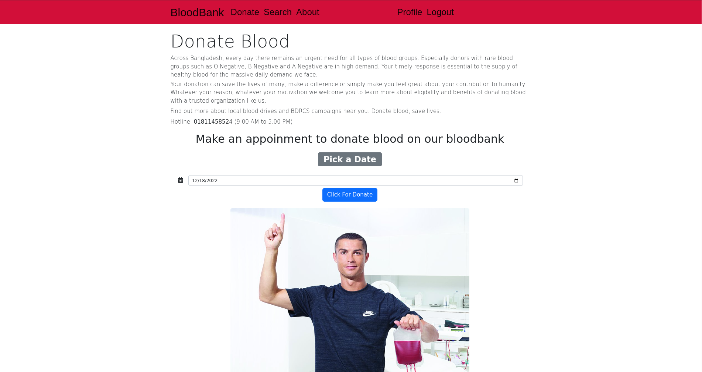
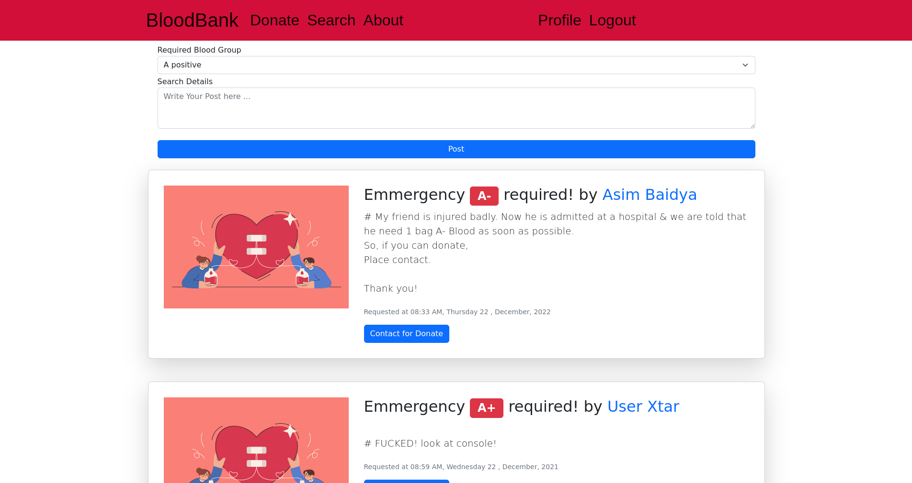
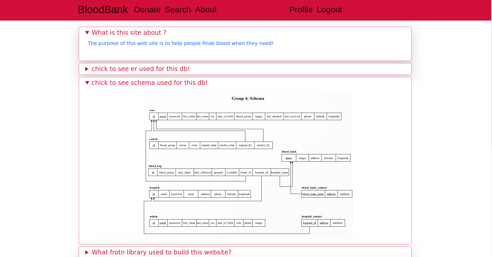
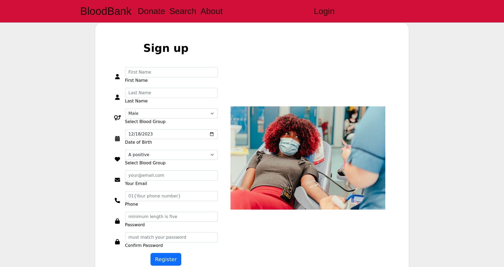
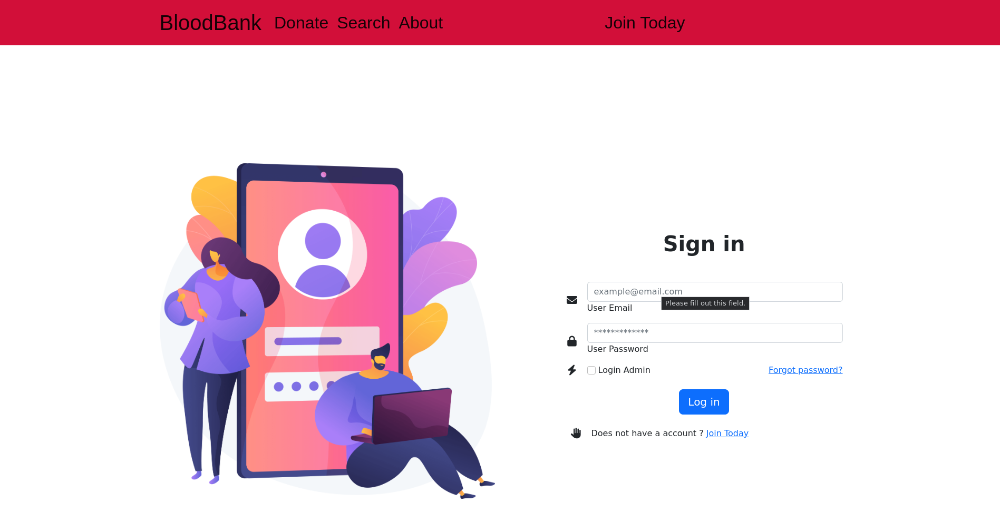
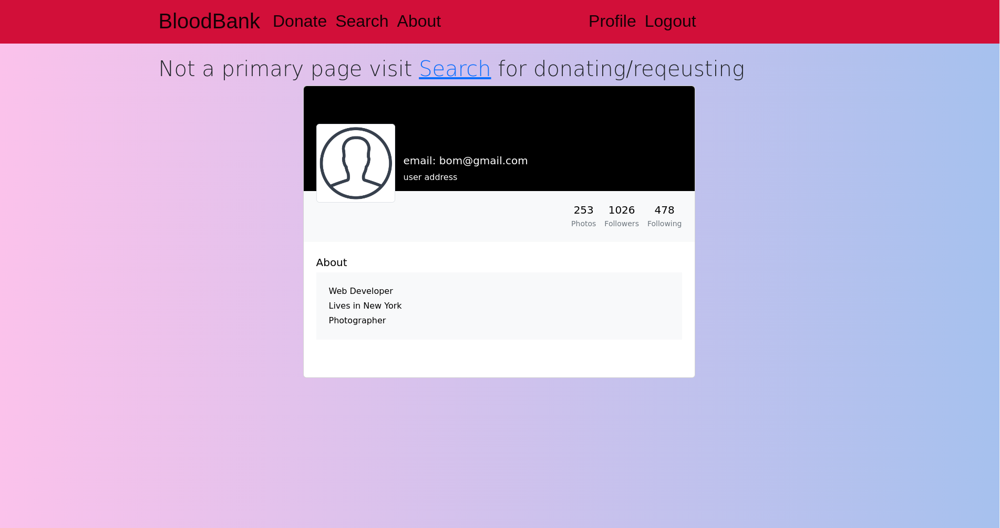

# Blood Bank Project(with additional feature)

a place to share 🩸 in emmergency with people & donatte at BloodBank more easily(incomplete)

## to test this project

- [x] install mysql\*
- [x] run db/db.sql in mysql shell(just use phpmyAdmin)
- [x] Finally to run the project, run this command from terminal

```bash
# from project folder
php -S localhost:8000
```

- Alternative option
  - xampp/mysql with virtual host
  - replace www/htdocs with this project & run apache server

## UI Overview

⚠️ Slides taken from [stanfordbloodcenter.org](https://stanfordbloodcenter.org/) without permission ⚠








